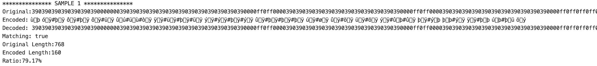
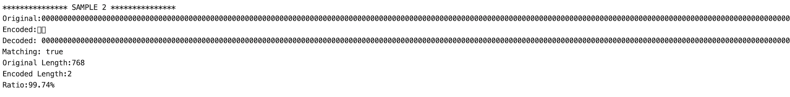
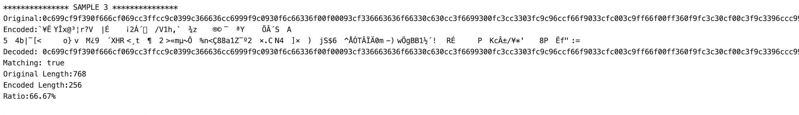

# PixelMap_Compression
Compression algorithm to convert the 16x16 image string of PixelMap.io into a shorter string in order to solve the PixelMap.io Compression Challenge.

## Background
The PixelMap.io Compression challenge is described [here](https://pixelmap.medium.com/tiles-hex-triplets-gas-prices-and-the-compression-contest-3adcfebcf3ac); 
## Implementation
This implementation does three steps, taking advantage to the fact that there are 256 single-byte UTF-8 characters:
   1) Convert each color into a single-byte UTF-8 character. There are only 216 colors from the [web safe colors](https://htmlcolorcodes.com/color-chart/web-safe-color-chart/).
   2) Compress the string of 256 single-byte UTF-8 characters by counting consecutive colors, and storing this number again into a single-byte UTF-8 character. 
   3) If the compression process returns a string longer than 256 characters, return the uncompressed string of length 256. Otherwise return the compressed string.

This means that in the worse case scenario, the algorithm will return a string of 256 characters, and in the best case scenario only 2 characters (an image with a unique color).

### Color Conversion

The 216 colors are mapped to a number between 0 and 215. The colors are currently expressed with a triplet where each value can only be 
one of the following 6 hex characters ['0', '3', '6', '9', 'c', 'f']. Therefore, replacing the triplet character by its index in the array ['0', '3', '6', '9', 'c', 'f'], 
we get the number expressed in base 6. As an example, 'ff0' becomes 055 (inverted), which is 0 * 36 + 5 * 6 + 5 = 35. Then calling String.fromCharCode(35), we get the character '#'.

### Color Repetition / Compression

The number of times a color is used in a row is also counted. This number is then converted into one of the 256 UTF-8 charaters and stored after the color. Since there are only 256 
pixels in the image, the case where an image consists of always the same color is covered.

### Choose whether to use the compression or not

In this step, the length of the converted string and of the compressed converted string are compared. If the compressed converted string is longer or equal to 256, it means that the compression actually
does not help. Therefore the converted string without the compression is given as result. If the compressed converted string is shorter than 256 characters, that string is given as result. 
During the decoding process, if the string has 256 characters, the decoding process simply does the inverse conversion without the decompression. If the string is shorter than 256, the decoding process 
starts with the decompression, and then the inverse conversion.

### Examples
```
********************** SAMPLE 1 **********************
[
  '390390390390390390390000000390390390390390390390',
  '390390390390390390000ff0ff0000390390390390390390',
  '390390390390390390000ff0ff0000390390390390390390',
  '390390390390390000ff0ff0ff0ff0000390390390390390',
  '000000000000000000ff0ff0ff0ff0000000000000000000',
  '000ff0ff0ff0ff0ff0ff0ff0ff0ff0ff0ff0ff0ff0ff0000',
  '390000ff0ff0ff0ff0000ff0ff0000ff0ff0ff0ff0000390',
  '390390000ff0ff0ff0000ff0ff0000ff0ff0ff0000390390',
  '390390390000ff0ff0000ff0ff0000ff0ff0000390390390',
  '390390390000ff0ff0ff0ff0ff0ff0ff0ff0000390390390',
  '390390000ff0ff0ff0ff0ff0ff0ff0ff0ff0ff0000390390',
  '390390000ff0ff0ff0ff0ff0ff0ff0ff0ff0ff0000390390',
  '390000ff0ff0ff0ff0ff0000000ff0ff0ff0ff0ff0000390',
  '390000ff0ff0ff0000000390390000000ff0ff0ff0000390',
  '000ff0ff0000000390390390390390390000000ff0ff0000',
  '000000000390390390390390390390390390390000000000'
]

```


**Ken's example image is now only 160 characters! 
Compression rate of 79.17%!**

```
********************** SAMPLE 2 **********************
[
  '000000000000000000000000000000000000000000000000',
  '000000000000000000000000000000000000000000000000',
  '000000000000000000000000000000000000000000000000',
  '000000000000000000000000000000000000000000000000',
  '000000000000000000000000000000000000000000000000',
  '000000000000000000000000000000000000000000000000',
  '000000000000000000000000000000000000000000000000',
  '000000000000000000000000000000000000000000000000',
  '000000000000000000000000000000000000000000000000',
  '000000000000000000000000000000000000000000000000',
  '000000000000000000000000000000000000000000000000',
  '000000000000000000000000000000000000000000000000',
  '000000000000000000000000000000000000000000000000',
  '000000000000000000000000000000000000000000000000',
  '000000000000000000000000000000000000000000000000',
  '000000000000000000000000000000000000000000000000',
]

```



```
********************** SAMPLE 3 **********************
[
  '0c699cf9f390f666cf069cc3ffcc9c0399c366636cc6999f',
  '9c0930f6c66336f00f00093cf336663636f66330c630cc3f',
  '6699300fc3cc3303fc9c96ccf66f9033cfc003c9ff66f00f',
  'f360f9fc3c30cf00c3f9c3396ccc9933303f3cf09f6c363c',
  '39900639c9633f0f93fcc69cccc0cc3606c6f33330f6f6f0',
  'f0333639063063330cc63c0c303f096f6c933ccf0f366393',
  'c63f33c6c0c6cc0cc0f9ff309f3c63399396f6f66993fc3c',
  'f9039f36cc966cf63c39f630f6cf960f900ccc390963f993',
  '9f03f69396f0f0f09f39cc0c360f633c9c636c6c693fc396',
  '0c393066c909f69030c3930cf06f3f99360c00fc66006c36',
  '3c00c3c0f63900c60f9996639006c39cc30930f0996ff0f9',
  '3036090c339f6936933c63630963fc03f66396cfffc333f3',
  'f60036c6366c996fffcc9f0306ccf6f36003093c0cc96f6f',
  '3ff06666f9cfc6f063309990fccf03f90f39cff3f60f30f3',
  '36393f00f9f0c999c0c3699f3f93c90c963630c9069c666f',
  '9fcf3399c03390300c03c693636c0cf9f0f6cf0cc0c933c3'
]
```



### Warning
I think that Solidity should be able to digest all the weird UTF-8 characters, but I am not 100% sure. :)

## Credit
I was inspired by the following two other solutions:
1. https://github.com/robinbihun/pixelmap.imagelib#readme
2. https://gist.github.com/pinealan/ad6de2d01fcc5d4ebc0396d3dd4da074